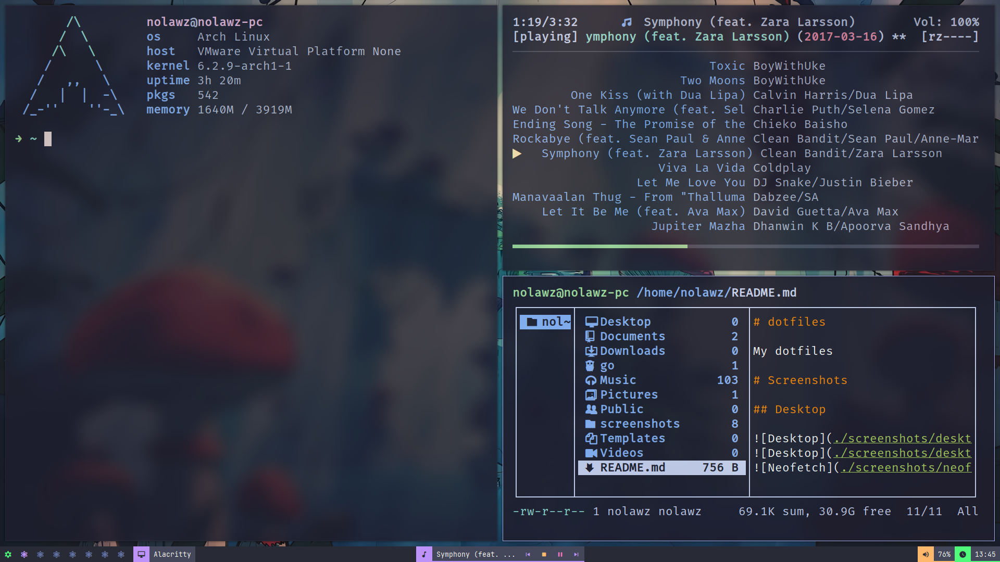
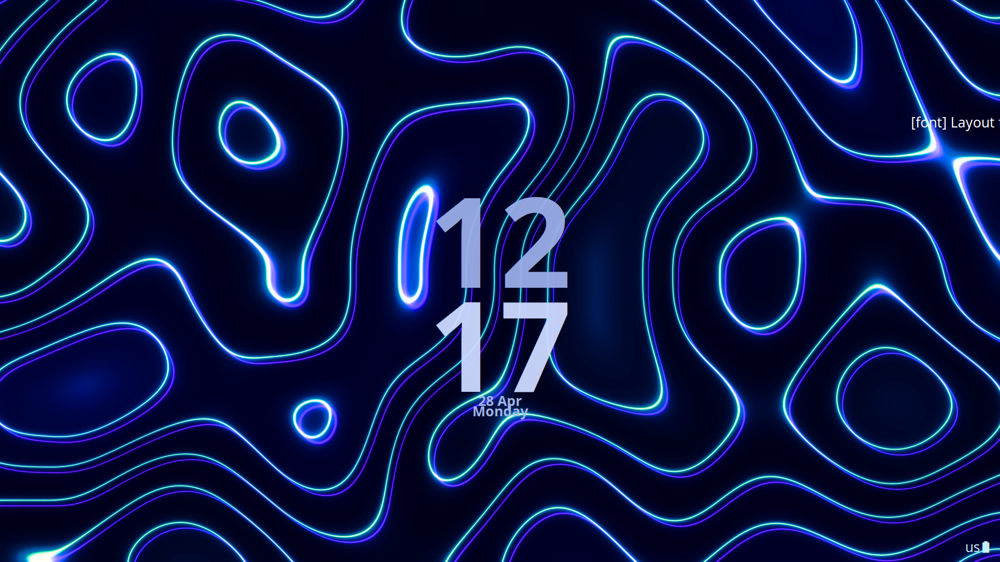
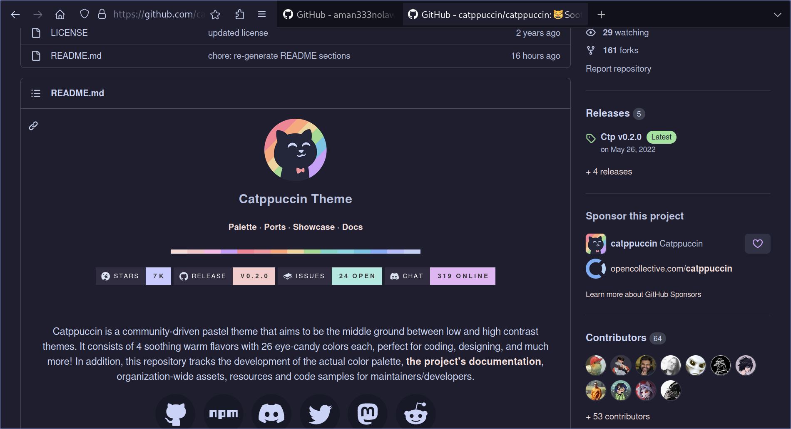
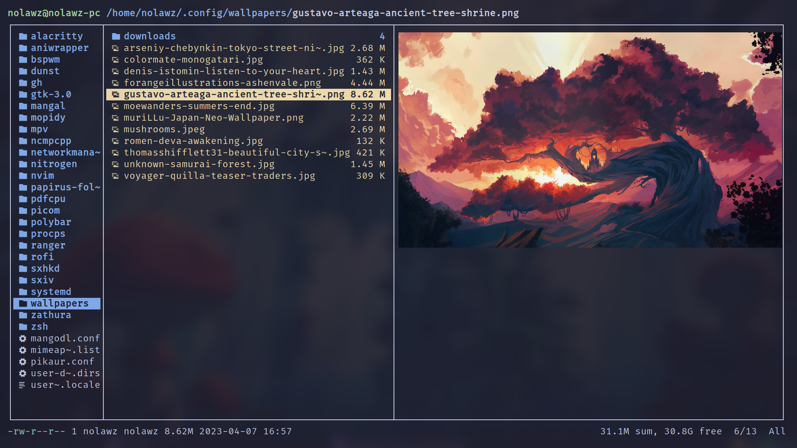

# dotfiles

My dotfiles

# Screenshots

## Desktop

## Screen Locker (i3lock-color)

## Firefox

Get the startpage from [aman333nolawz/startpage](https://github.com/aman333nolawz/startpage) or [aman333nolawz/startpage-v2](https://github.com/aman333nolawz/startpage-v2)

Get the firefox theme from [andreasgrafen/cascade](https://github.com/andreasgrafen/cascade)

## TUI File Manager (Ranger)

## Ncmpcpp

## Neovim

## Zathura

