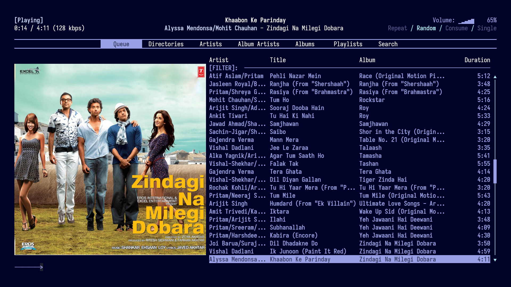

# dotfiles

My dotfiles. Thanks to [Hyde](https://github.com/HyDE-Project/HyDE/) for a wonderful template

# Screenshots

## Desktop

## Screen Locker (hyprlock)

## Rmpc (Music player)

## Text editor (Neovim)

## Zathura

