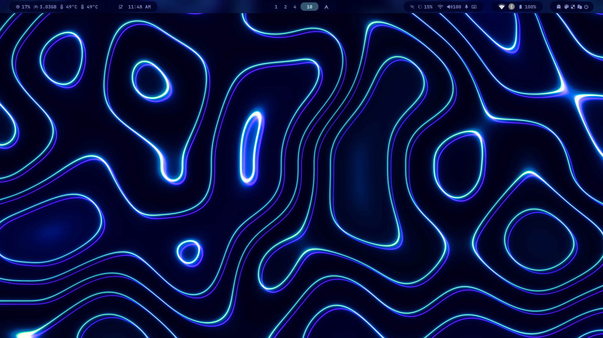
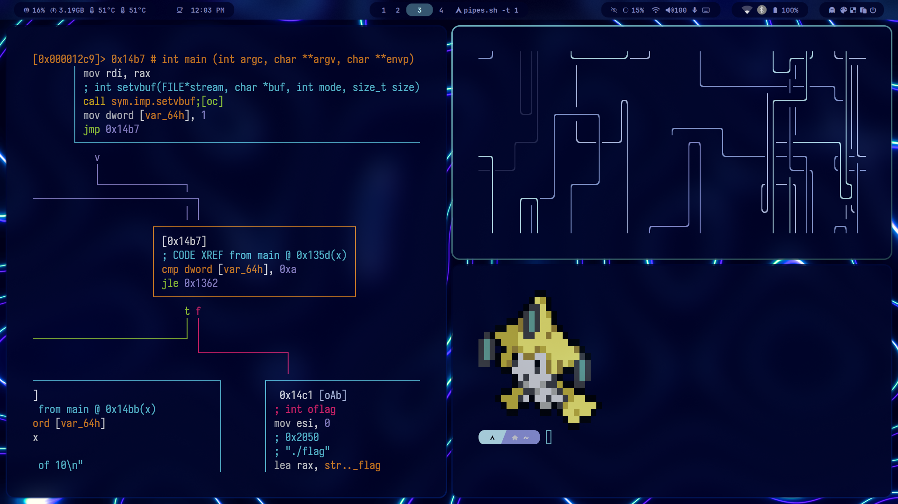

# dotfiles

My dotfiles

# Screenshots

## Desktop

## Screen Locker (swaylock)

## Firefox

Get the startpage from [aman333nolawz/startpage](https://github.com/aman333nolawz/startpage) or [aman333nolawz/startpage-v2](https://github.com/aman333nolawz/startpage-v2)

Get the firefox theme from [andreasgrafen/cascade](https://github.com/andreasgrafen/cascade)

## TUI File Manager (Lf)

## Ncmpcpp

## Text editor (Emacs & Neovim)

### Emacs

### Neovim

## Zathura

